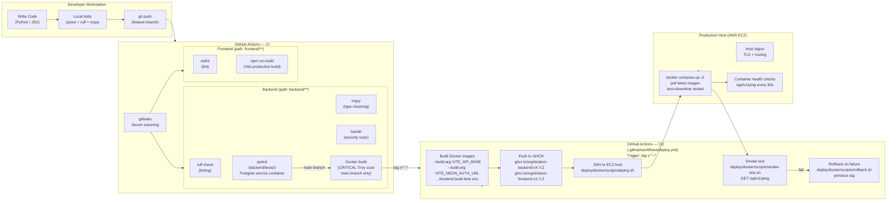
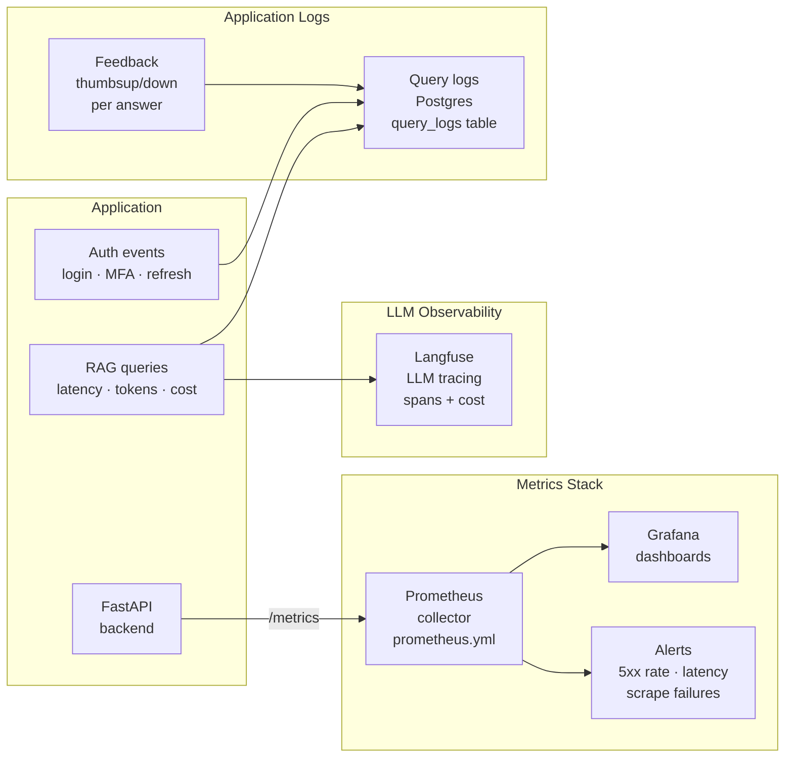

# DevOps — CI/CD, Observability, and Infrastructure

*Documentation index: [docs/README.md](./README.md)*

Stratum wires **local development**, **Docker Compose**, **Kubernetes (Kustomize)**, **Terraform** (namespaces + observability bootstrap), **GitHub Actions CI/CD**, and **pytest** into one end-to-end DevOps pipeline — from a developer's editor to a production EC2 host or Kubernetes cluster.

---

## Quick Reference

| Concern | Location |
|---------|----------|
| Environment templates | `config/env/` |
| Secret management patterns | `config/SECRETS.md` |
| Backend tests | `backend/tests/` + `requirements-ci.txt` |
| GitHub Actions CI | `.github/workflows/ci.yml` |
| GitHub Actions CD (deploy) | `.github/workflows/deploy.yml` |
| Jenkins (optional alt CI) | `Jenkinsfile` (see section below) |
| Docker Compose | `deploy/docker/docker-compose.yml` |
| Docker Compose dev overlay | `deploy/docker/docker-compose.dev.yml` |
| Deploy / rollback / smoke scripts | `deploy/docker/scripts/` |
| Kubernetes manifests | `deploy/k8s/` (Kustomize base + production overlay) |
| Terraform | `infra/terraform/` |
| Observability config | `observability/docker/prometheus.yml` + `grafana/` |
| AWS EC2 production runbook | `docs/AWS_EC2_PRODUCTION_GUIDE.md` |
| System design | `docs/system-design.md` |
| MLOps lifecycle | `mlops/README.md` |

---

## Full DevOps Pipeline



---

## CI Pipeline Detail

### Trigger conditions

| Trigger | Jobs that run |
|---------|--------------|
| Any push / PR | Secret scanning (gitleaks), path-filtered backend + frontend checks |
| Push to `main` affecting `backend/**` | Full backend CI + Docker build + Trivy |
| Push to `main` affecting `frontend/**` | Full frontend CI + Docker build + Trivy |
| Tag `v*.*.*` | Build, push images, SSH deploy, smoke test |

### Backend CI stages (`.github/workflows/ci.yml`)

```
Python 3.12
├── pip install -r requirements-ci.txt
├── ruff check app/ ingestion/ tests/         ← fast linting
├── mypy app/                                 ← type checking
├── bandit -r app/                            ← security scan (OWASP)
└── pytest tests/ -v --tb=short              ← unit + integration tests
     (Postgres 16 service container available at localhost:5432)
```

### Frontend CI stages

```
Node.js 24
├── npm ci
├── npm run lint                             ← ESLint 9
└── npm run build                           ← Vite production build (smoke)
```

### Docker security scan (main branch only)

```
docker build backend/  (or frontend/)
trivy image --exit-code 1 --severity CRITICAL <image>
```
Blocks merge if any CRITICAL CVE is found in the built image.

---

## CD Pipeline Detail

### Release process

```bash
# 1. Validate CI is green on main
# 2. Create and push a semantic version tag
git tag v1.2.0
git push origin v1.2.0

# 3. GitHub Actions deploy.yml fires automatically
#    - Builds backend + frontend Docker images
#    - Injects frontend build-time env (VITE_* from GitHub secrets)
#    - Pushes tagged images to GHCR
#    - SSH into EC2 host
#    - Runs deploy.sh (docker compose pull + up)
#    - Runs smoke-test.sh
#    - Rolls back on failure
```

### GitHub Actions secrets required for deploy

| Secret | Used in | Purpose |
|--------|---------|---------|
| `DOCKER_USERNAME` | deploy.yml | GHCR login |
| `DOCKER_PASSWORD` | deploy.yml | GHCR token |
| `DEPLOY_HOST` | deploy.yml | EC2 IP or hostname |
| `DEPLOY_USER` | deploy.yml | SSH username |
| `DEPLOY_SSH_KEY` | deploy.yml | SSH private key |
| `VITE_API_BASE` | deploy.yml | Frontend build-time API prefix |
| `VITE_NEON_AUTH_URL` | deploy.yml | Neon Auth endpoint |
| `VITE_AUTH_REDIRECT_URL` | deploy.yml | OAuth redirect |
| `VITE_AUTH_PASSWORD_RESET_REDIRECT_URL` | deploy.yml | Password reset redirect |
| `VITE_AUTH_REFRESH_COOKIE` | deploy.yml | `true` for HttpOnly cookie refresh |
| `GRAFANA_ADMIN_USER` | deploy.yml | Grafana admin username |
| `GRAFANA_ADMIN_PASSWORD` | deploy.yml | Grafana admin password |

### deploy.sh flow

```
1. Export APP_TAG, BACKEND_IMAGE, FRONTEND_IMAGE
2. cd /opt/stratum
3. docker compose -f deploy/docker/docker-compose.yml pull
4. docker compose -f deploy/docker/docker-compose.yml up -d --remove-orphans
5. Wait for containers to stabilize (health check loop)
```

### smoke-test.sh

```
GET http://localhost:8000/api/v1/ping
→ assert HTTP 200 + {"status":"ok"}
```

### rollback.sh

```
Export APP_TAG_PREVIOUS
docker compose pull previous-tag images
docker compose up -d with previous tag
Run smoke-test
```

---

## Docker Compose Setup

### Production Compose services (`deploy/docker/docker-compose.yml`)

| Service | Image | Port | Purpose |
|---------|-------|------|---------|
| `backend` | `${BACKEND_IMAGE}:${APP_TAG}` | 8000 | FastAPI + Uvicorn |
| `frontend` | `${FRONTEND_IMAGE}:${APP_TAG}` | 8080 | nginx serving React SPA |
| `redis` | `redis:7-alpine` | 6379 (internal) | Rate limit storage |
| `prometheus` | `prom/prometheus` | 9090 | Metrics (observability profile) |
| `grafana` | `grafana/grafana` | 3000 | Dashboards (observability profile) |

Start production stack:
```bash
docker compose -f deploy/docker/docker-compose.yml up -d

# With observability:
docker compose -f deploy/docker/docker-compose.yml --profile observability up -d
```

### Development Compose overlay (`docker-compose.dev.yml`)

Builds from source (no pre-built images), mounts code volumes for hot-reload:
```bash
docker compose -f deploy/docker/docker-compose.yml \
               -f deploy/docker/docker-compose.dev.yml up --build
```

### Required files before `docker compose up`

- `backend/.env` — created from `config/env/backend.env.prod`
- Minimum secrets: `DATABASE_URL`, `JWT_SECRET_KEY`, `GROQ_API_KEY`, `RATE_LIMIT_STORAGE_URL=redis://redis:6379`

---

## Kubernetes Deployment

### Stack

- **Kustomize** base + production overlay at `deploy/k8s/`
- **Terraform** provisions namespaces and optionally installs **kube-prometheus-stack** via Helm at `infra/terraform/`

### Deploy steps

```bash
# 1. Bootstrap namespaces and observability
cd infra/terraform
terraform init
terraform apply    # creates stratum + observability namespaces; installs kube-prometheus-stack

# 2. Create the application secret
kubectl apply -f deploy/k8s/base/secrets.example.yaml
# (edit to contain real DATABASE_URL, JWT_SECRET_KEY, GROQ_API_KEY)

# 3. Deploy application
kubectl apply -k deploy/k8s/overlays/production
```

### K8s manifest structure

```
deploy/k8s/
├── base/
│   ├── kustomization.yaml         — base resource list
│   ├── namespace.yaml             — stratum namespace
│   ├── configmap.yaml             — non-secret config
│   ├── secrets.example.yaml       — secret template (do not commit real values)
│   ├── ingress.yaml               — Ingress with TLS + routing rules
│   ├── backend-deployment.yaml    — FastAPI Deployment + HPA config
│   ├── backend-service.yaml       — ClusterIP :8000
│   ├── frontend-deployment.yaml   — nginx Deployment
│   └── frontend-service.yaml      — ClusterIP :80
└── overlays/production/
    └── kustomization.yaml         — image tag overrides, replica counts, resource limits
```

---

## Local Development Stack

### One command (recommended)

From repository root (backend venv active):

```bash
npm install      # once — installs concurrently
npm run dev      # starts FastAPI + Vite concurrently
```

- FastAPI: `http://127.0.0.1:8000` (hot-reload watching `app/` + `ingestion/`)
- Vite: `http://localhost:5173` (waits for API ping before starting)
- Swagger: `http://127.0.0.1:8000/docs`

### Manual two-terminal startup

```bash
# Terminal 1 — backend
cd backend
python -m uvicorn app.main:app \
  --reload --reload-delay 0.75 \
  --reload-dir app --reload-dir ingestion \
  --host 127.0.0.1 --port 8000

# Terminal 2 — frontend
cd frontend
npm run dev
```

### Local stack with observability

```bash
# Requires backend/.env with METRICS_ENABLED=true
docker compose -f deploy/docker/docker-compose.yml --profile observability up -d --build
```

- Grafana: `http://localhost:3000` (credentials from `GRAFANA_ADMIN_USER`/`GRAFANA_ADMIN_PASSWORD`)
- Prometheus: `http://localhost:9090`
- Prometheus scrapes `backend:8000/metrics`

---

## Observability



### Prometheus metrics exposed

Stratum uses **`prometheus-fastapi-instrumentator`** to auto-expose:

| Metric | Description |
|--------|-------------|
| `http_requests_total` | Request count by method, path, status |
| `http_request_duration_seconds` | Latency histogram by endpoint |
| `http_requests_in_progress` | Active concurrent requests |

Enable with `METRICS_ENABLED=true` in `backend/.env`.

### Langfuse LLM tracing

Set `LANGFUSE_PUBLIC_KEY`, `LANGFUSE_SECRET_KEY`, and `LANGFUSE_HOST` in `backend/.env`. Every `/chat`, `/ask`, and `/search` request creates a Langfuse trace with:
- Input prompt + retrieved context
- LLM output + token count
- End-to-end latency
- Cost estimate (based on model pricing)

---

## Jenkins (Alternative CI)

The sample `Jenkinsfile` (in repo root) provides:

```groovy
stage('Postgres for tests') {
    // Spins docker run postgres:16 on port 5433
    // Injects DATABASE_URL via env
}
stage('Backend CI') {
    // pip install, ruff, mypy, bandit, pytest
}
stage('Frontend CI') {
    // npm ci, lint, build
}
stage('Docker Build + Scan') {
    // docker build, trivy scan
}
stage('Deploy') {
    // withCredentials inject registry + SSH creds
    // same deploy.sh as GitHub Actions
}
```

For production Jenkins, inject secrets via `withCredentials` block or a vault plugin — **never** hardcode credentials in `Jenkinsfile`.

---

## Backup and Restore

### What to back up

| Data | Location | Criticality |
|------|----------|------------|
| PostgreSQL | Neon managed (automatic PITR) | High — all user and article data |
| ChromaDB | `/opt/stratum/data/chroma_db` (Docker volume) | Medium — rebuildable from PDFs |
| Whoosh index | `/opt/stratum/data/whoosh_index` | Low — rebuilt automatically on reindex |
| Raw PDFs | `/opt/stratum/data/raw` | High — source of truth for RAG corpus |
| Avatars | `/opt/stratum/data/uploads` (or S3) | Low |

### Backup script

```bash
cd /opt/stratum
deploy/docker/scripts/backup.sh
# Creates: /opt/stratum/backups/backend_data_YYYYMMDD-HHMMSS.tar.gz
```

### Restore script

```bash
BACKUP_ARCHIVE=/opt/stratum/backups/backend_data_YYYYMMDD-HHMMSS.tar.gz \
deploy/docker/scripts/restore.sh
```

### Recovery SLOs (recommended)

| Component | RTO | RPO |
|-----------|-----|-----|
| Postgres (Neon PITR) | < 30 min | < 5 min |
| Chroma + Whoosh | < 60 min (reindex from PDFs) | Latest ingestion |
| Application (rollback) | < 10 min | N/A |

---

## Security in CI/CD

| Control | Where |
|---------|-------|
| **gitleaks** secret scanning | CI — every push |
| **Trivy** container CRITICAL scan | CI — main branch Docker builds |
| **bandit** SAST | CI — every backend push |
| **No secrets in Git** | `config/SECRETS.md` patterns; `.gitignore` on `*.env` |
| **SSH deploy keys** | GitHub Actions secrets; non-root `deployer` user on EC2 |
| **GHCR private** | Images are org-private; access via `DOCKER_PASSWORD` secret |
| **Env files on host only** | `backend/.env` created on EC2 from `backend.env.prod` template; never committed |

---

## Production Checklist

Before going live, verify all items in [docs/AWS_EC2_PRODUCTION_GUIDE.md](./AWS_EC2_PRODUCTION_GUIDE.md). Summary:

- [ ] EC2 hardened (UFW, SSH key-only, non-root deploy user)
- [ ] `backend/.env` created on host from prod template (not in Git)
- [ ] All GitHub secrets set (Docker, Deploy SSH, Grafana, all VITE_*)
- [ ] JWT_SECRET_KEY rotated and strong (≥ 32 chars)
- [ ] Redis-backed rate limiting (`RATE_LIMIT_STORAGE_URL=redis://redis:6379`)
- [ ] TLS enabled with valid certificate (Let's Encrypt / Certbot)
- [ ] S3 bucket configured for avatars (or confirmed local disk is OK)
- [ ] `EXPOSE_API_DOCS=false` in production
- [ ] `ENVIRONMENT=production` set
- [ ] Deploy and rollback scripts tested on a staging environment
- [ ] Smoke tests pass after first production deploy
- [ ] Backup/restore procedure documented and tested
- [ ] Prometheus + Grafana alerting configured (5xx spike, high latency)
