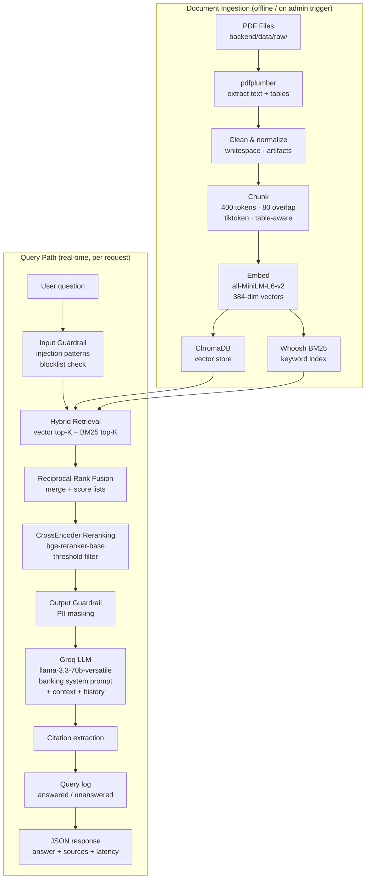
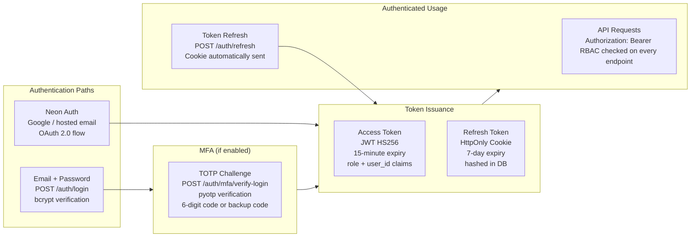
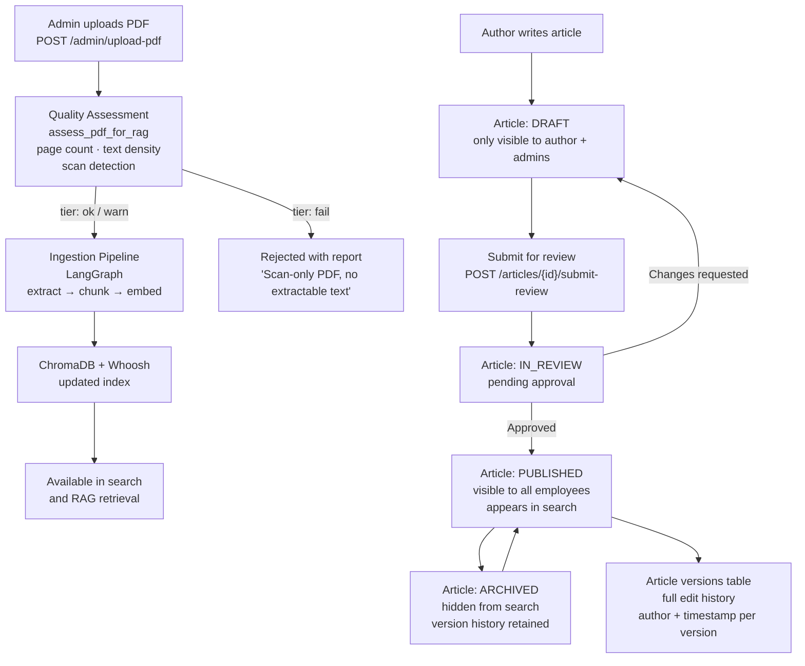
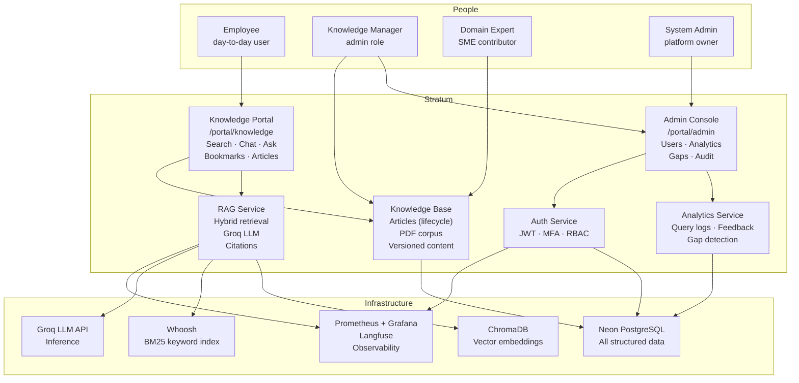

# How Stratum Works

*Project documentation index: [docs/README.md](./README.md)*

---

## Problem Statement

### The Banking Knowledge Problem

Banking software teams operate at the intersection of highly regulated domain knowledge and complex technical systems. This creates a **knowledge fragmentation crisis**:

**Organizational pain points:**
- Policies, procedures, and regulations scattered across SharePoint, Confluence, emails, shared drives, and individual inboxes — no single source of truth
- New engineers spend 3–6 weeks learning institutional knowledge that should be discoverable in minutes
- Outdated policy documents create compliance risk — staff may act on superseded procedures
- Keyword search tools fail for semantic questions ("what's the KYC process for high-net-worth clients?")
- No record of what knowledge employees access, which questions go unanswered, or where content gaps exist
- Subject-matter experts become bottlenecks because knowledge isn't codified or searchable

**Business consequences:**
- High onboarding cost and time-to-productivity
- Compliance exposure from misinterpreted or outdated documentation
- Repeated escalations of questions that already have answers somewhere
- No feedback loop — leadership cannot see what employees can't find

### The Solution: Stratum

Stratum replaces the scattered-docs model with a **governed, AI-augmented knowledge mesh**:

1. **Single source of truth**: all approved documentation in one searchable platform, with versioned articles and role-gated access
2. **AI-powered retrieval**: hybrid semantic + keyword search with a grounded LLM that can answer in natural language and cite its sources
3. **Governance layer**: article lifecycle workflow (Draft → Review → Published → Archived), admin controls, document quality checks, audit trail
4. **Knowledge gap visibility**: every unanswered query is logged — admins can see what employees can't find, and close those gaps proactively
5. **Self-service expertise**: expert directory and learning paths reduce dependency on ad-hoc escalation

---

## How the Product Works

### User Journey (Employee)

```
1. Sign in
   ↓  Email/password (+ TOTP MFA if enabled)
   ↓  Or Google SSO via Neon Auth
   ↓  JWT access token issued; role embedded in claims

2. Knowledge Hub (/portal/knowledge)
   ├─ Browse published articles by category
   ├─ Search: full-text hybrid (vector + BM25) across articles and PDFs
   └─ Bookmark articles for quick reference

3. Ask the AI Copilot
   ├─ /chat  — multi-turn conversation with memory
   └─ /ask   — single-turn Q&A with citations
   Each answer includes:
   ├─ Generated text (grounded on retrieved chunks only)
   ├─ Source citations (document name + page)
   └─ Confidence indicators

4. Rate answers (thumbs up/down) → drives quality analytics

5. Learning Paths — follow curated content sequences at your own pace

6. Expert Directory — find the right person to escalate edge cases
```

### User Journey (Admin / Knowledge Manager)

```
1. Admin Console (/portal/admin)
   ├─ Users — create/edit/delete accounts, set roles
   ├─ Analytics — usage stats, top queries, feedback scores
   ├─ Query Logs — see every question asked, answered or not
   ├─ Knowledge Gaps — unanswered queries aggregated for action
   └─ Audit Events — security and admin event log

2. Knowledge Base Management
   ├─ Create articles (rich text, with source PDF links)
   ├─ Upload PDFs — quality check runs automatically on upload
   │     Quality report: page count, text density, scan detection
   │     tier: ok / warn / fail
   ├─ Trigger reindex — rebuild ChromaDB + Whoosh from all PDFs
   └─ Article review workflow:
         Author creates draft
         ↓
         Submits for review
         ↓
         Knowledge admin / domain expert approves
         ↓
         Published and searchable
         ↓
         Archived (retains version history)
```

---

## How the RAG Pipeline Works



### Why Hybrid Retrieval?

Banking documentation has two distinct retrieval needs:

| Signal | Why it matters | Handled by |
|--------|----------------|-----------|
| **Semantic similarity** | "What is the process for large transaction reporting?" matches documents about "STR filing requirements" even without exact word overlap | ChromaDB vector search |
| **Exact keyword match** | Regulatory codes (KYC, AML, FATF, PSD2), product names, and procedure IDs must match precisely | Whoosh BM25 |

Reciprocal Rank Fusion (RRF) merges both ranked lists without requiring score calibration. CrossEncoder reranking then applies a more accurate relevance model to the fused shortlist, filtering out chunks below the confidence threshold.

### Why Guardrails?

| Guardrail | What it catches | Why it matters in banking |
|-----------|----------------|--------------------------|
| **Input: injection patterns** | Attempts to override the system prompt or exfiltrate context | Prevents model hijacking in a regulated environment |
| **Input: blocklist** | Topic categories outside the system's scope | Keeps the model focused; reduces liability |
| **Output: PII masking** | Phone numbers, email addresses, card numbers | Prevents accidental PII leakage in generated text |
| **Output: confidence threshold** | Reranker score too low → "I don't have enough information" | Prevents confident-sounding hallucinations |

---

## How Auth Works



### Token security model

- **Access tokens** are short-lived (15 min) and bearer-only — stored in memory by the SPA, never in localStorage
- **Refresh tokens** use HttpOnly cookies — JavaScript cannot read them; CSRF-safe because they require the `POST /auth/refresh` endpoint
- **Refresh hash stored in DB** — logout and password changes immediately invalidate all sessions
- **MFA backup codes** are stored as bcrypt hashes in Postgres — single-use, limited count

---

## How Knowledge Governance Works



---

## How Analytics and Gap Closing Works

Every RAG query is logged to the `query_logs` table with:

- `user_id` — who asked
- `query_text` — what they asked
- `answered` — did the reranker find confident results?
- `latency_ms` — end-to-end response time
- `source_ids` — which chunks were cited

The **Knowledge Gaps** admin view (`GET /admin/knowledge-gaps`) aggregates rows where `answered = false`, groups by query similarity, and surfaces the most-frequently-asked unanswered questions — giving content managers a data-driven prioritization queue for new documentation.

```
Unanswered queries → Knowledge Gap report
       ↓
Content manager creates missing article or uploads source PDF
       ↓
Article published / PDF ingested → re-indexed
       ↓
Future queries on same topic → answered
       ↓
Gap closed
```

---

## How the Full Product Fits Together



---

## Non-functional Characteristics

| Property | Implementation | Level |
|----------|---------------|-------|
| **Latency** | Singletons avoid model reload; reranker on shortlist only; optional startup warmup | Typically 1–4s per RAG query (Groq dependent) |
| **Throughput** | Rate-limited at 200 req/min per IP; Redis-backed in production | Tunable via `RATE_LIMIT_*` env vars |
| **Availability** | Docker Compose with health checks; K8s HPA; rollback scripts | EC2: manual rollback; K8s: rolling updates |
| **Durability** | Postgres on Neon (managed, replicated); Chroma + Whoosh on persistent volume; backup scripts | Weekly backup recommended |
| **Security** | RBAC on all endpoints; OWASP security headers; CSP; HTTPS; PII masking; secret scanning in CI | Production-hardened |
| **Observability** | Prometheus metrics at `/metrics`; Langfuse LLM traces; query logs in Postgres | Full-stack visibility |
| **Compliance** | Audit event log; article version history; knowledge access log; no PII in LLM responses | Suitable for regulated internal use |
