# RAG Pipeline — Architecture, Audit, and Enhancement Roadmap

*Documentation index: [docs/README.md](./README.md)*

Stratum's RAG pipeline is a **production-grade hybrid retrieval + LLM generation** system designed for the specific needs of banking knowledge management: exact regulatory terminology matters (BM25), conceptual questions need semantic understanding (vector), and every answer must be grounded in cited source documents.

---

## Pipeline Overview

```mermaid
flowchart TB
  subgraph Ingestion["Offline Ingestion\n(python -m ingestion.main  or  POST /admin/reindex)"]
    PDF["PDF Files\nbackend/data/raw/"] --> EXTRACT["extract.py\npdfplumber\ntext + tables + metadata\npage-level provenance"]
    EXTRACT --> CLEAN["clean.py\nnormalize whitespace\nstrip artifacts\npage metadata preserved"]
    CLEAN --> CHUNK["chunk.py\ntiktoken chunking\n400 tokens · 80 overlap\ntable-aware splits\nfile hash dedup"]
    CHUNK --> EMBED["embed.py\nSentenceTransformers\nall-MiniLM-L6-v2\n384-dim vectors\nbatch=64"]
    EMBED --> STORE_C["ChromaDB\npersistent vector store\n+ metadata"]
    EMBED --> STORE_W["Whoosh BM25\nkeyword index\nrebuilt from Chroma docs"]
  end

  subgraph QueryPath["Real-time Query Path\n(per request — singletons loaded once per process)"]
    Q["User question\n(+ conversation history)"] --> G_IN["Input Guardrail\ninjection regex patterns\nblocklist check\n→ 400 if blocked"]
    G_IN --> DENSE["Chroma dense search\ntop_k_vector neighbours\ncosine similarity"]
    G_IN --> SPARSE["Whoosh BM25\ntop_k_bm25 matches\nkeyword scoring"]
    DENSE --> RRF["Reciprocal Rank Fusion\nmerge ranked lists\nno score calibration needed"]
    SPARSE --> RRF
    RRF --> RERANK["CrossEncoder Reranking\nBAI/bge-reranker-base\nmax_length=512\nscore threshold filter"]
    RERANK --> G_OUT["Output Guardrail\nPII masking\n(phone · email · card numbers)\nconfidence check"]
    G_OUT --> PROMPT["Prompt construction\nbanking system prompt\n+ retrieved context\n+ conversation history\n+ anti-hallucination instruction"]
    PROMPT --> LLM["Groq LLM\nllama-3.3-70b-versatile\ntemperature=0 (factual)"]
    LLM --> CITE["Citation extraction\nsource doc names\npage numbers"]
    CITE --> LOG["Query logger\nuser_id · query · answered\nlatency_ms · source_ids"]
    LOG --> RESP["Response\n{\n  answer: string,\n  sources: [...],\n  latency_ms: int\n}"]
  end
```



---

## Current Implementation (Solid Baseline)

| Stage | Implementation | Notes |
|-------|------------------|-------|
| **Ingest** | LangGraph: extract → clean → merge → chunk → embed → Chroma | File-hash dedup avoids re-embedding unchanged PDFs |
| **Retrieve — dense** | ChromaDB cosine similarity search | 384-dim `all-MiniLM-L6-v2` embeddings; top-K configurable |
| **Retrieve — sparse** | Whoosh BM25; index rebuilt from Chroma on every ingest run | Exact-term matching for regulatory codes, product names |
| **Fuse** | Reciprocal Rank Fusion (RRF) | Standard, cheap, no training required |
| **Rerank** | CrossEncoder `BAAI/bge-reranker-base` | Strong quality upgrade vs. fusion-only; `max_length=512` |
| **Generate** | Groq `llama-3.3-70b-versatile` with grounded banking system prompt | "Answer from context only" policy enforced |
| **Safety — input** | Injection regex, prompt manipulation patterns, blocklist | OWASP-aligned input gate |
| **Safety — output** | PII masking (phone/email/card), confidence/rerank threshold gate | Prevents PII leak and low-confidence hallucinations |
| **Observability** | Langfuse traces per query, Prometheus HTTP metrics, query logs in Postgres | Production-oriented full-stack visibility |
| **Doc QC (upload)** | `assess_pdf_for_rag` runs on every `POST /admin/upload-pdf` | Flags scan-only / empty-text PDFs before ingest |
| **Eval (offline)** | `tools/evaluate_rag.py` + `data/eval_qa.json` → Ragas metrics | Faithfulness, answer relevancy on golden Q&A set |

**Model singletons:** `SentenceTransformer`, `CrossEncoder`, `ChromaDB client`, and `Whoosh searcher` are loaded **once per process** via `app/services/rag_providers.py`. No cold-start per request. Optional `RAG_WARMUP_ON_STARTUP=true` pre-loads in a background thread on API startup.

---

## Configuration Reference

| Variable | Default | Description |
|----------|---------|-------------|
| `EMBEDDING_MODEL` | `all-MiniLM-L6-v2` | HuggingFace model name for embedding |
| `RERANKER_MODEL` | `BAAI/bge-reranker-base` | CrossEncoder model name |
| `GROQ_MODEL` | `llama-3.3-70b-versatile` | Groq LLM model ID |
| `TOP_K_VECTOR` | `20` | Number of dense neighbours to retrieve |
| `TOP_K_BM25` | `20` | Number of BM25 matches to retrieve |
| `RERANKER_THRESHOLD` | `0.0` | Minimum CrossEncoder score to include chunk |
| `TOP_K_FINAL` | `5` | Max chunks passed to LLM after reranking |
| `CHUNK_SIZE` | `400` | Tokens per chunk (tiktoken `cl100k_base`) |
| `CHUNK_OVERLAP` | `80` | Overlap tokens between chunks |
| `CHROMA_PERSIST_DIR` | `data/chroma_db` | ChromaDB storage path |
| `WHOOSH_INDEX_DIR` | `data/whoosh_index` | Whoosh index path |
| `RAG_WARMUP_ON_STARTUP` | `false` | Pre-load models on startup (recommended in production) |

---

## Retrieval: Why Hybrid?

Banking documents contain two classes of retrieval challenge:

| Challenge | Example | Best signal |
|-----------|---------|------------|
| Conceptual / semantic | "What's the policy for onboarding high-risk clients?" | Dense vector (semantic similarity) |
| Exact terminology | "PSD2", "KYC", "FATF Recommendation 16", "SWIFT MT103" | BM25 keyword (exact match) |

Neither approach alone is sufficient:
- **Dense-only**: misses exact regulatory codes that embeddings may conflate with related terms
- **Sparse-only**: misses paraphrased queries that don't use the exact document vocabulary

**RRF fusion** combines both ranked lists by reciprocal rank without requiring score normalization:

```
RRF_score(d) = Σ 1 / (k + rank(d))   for each retriever
  where k=60 (smoothing constant)
```

---

## Reranking: Why CrossEncoder?

After RRF, the top-N candidates are re-scored by a **CrossEncoder** (BAAI/bge-reranker-base):

- **Bi-encoders** (used for initial retrieval) encode query and document independently → fast but less accurate
- **CrossEncoder** takes (query, document) together as a single input → slower but significantly more accurate relevance judgment
- Applied to the RRF shortlist (~40 candidates) rather than the full corpus — acceptable latency for the quality gain

Documents below `RERANKER_THRESHOLD` are dropped before the LLM sees them, which prevents the model from generating a hallucinated answer from weak context.

---

## Guardrails

### Input Guardrail (`app/services/guardrail_service.py`)

Checks the user query before any retrieval:

| Check | Pattern | Response if triggered |
|-------|---------|----------------------|
| Prompt injection | Patterns like "ignore previous instructions", "system:", "you are now" | HTTP 400 — blocked before RAG |
| Blocklist keywords | Configurable banned topic list | HTTP 400 — out-of-scope query |

### Output Guardrail

Applied after reranking, before LLM:
- **Confidence gate**: if no chunk exceeds `RERANKER_THRESHOLD`, return "I don't have enough information in the knowledge base" without calling the LLM
- **PII masking**: post-generation regex scan strips phone numbers (`\b\d{3}[-.\s]?\d{3}[-.\s]?\d{4}\b`), email addresses, and 16-digit card numbers from LLM output

---

## Document Quality Check

Every PDF uploaded via `POST /admin/upload-pdf` passes through `assess_pdf_for_rag` before being stored:

| Check | Method | Tier outcome |
|-------|--------|-------------|
| File is valid PDF | PDF magic bytes | fail |
| File is not empty | Size check | fail |
| Text is extractable | pdfplumber character count per page | fail / warn |
| Text density adequate | Chars per page above threshold | warn |
| Page count reasonable | Below min threshold | warn |
| Scan-only PDF | Nearly zero extractable chars → likely scanned image | warn / fail |

The quality report (tier + messages array) is returned in the upload response. `tier: fail` blocks ingest. `tier: warn` allows ingest with a warning logged. `tier: ok` proceeds normally.

For scan-only PDFs: run `ocrmypdf` to add a text layer, then re-upload.

---

## Offline Evaluation

### Running the eval

```bash
cd backend
python tools/evaluate_rag.py
# Reads: data/eval_qa.json
# Output: data/eval_metrics_results.json
```

### eval_qa.json format

```json
[
  {
    "question": "What is the minimum CDD requirement for retail customers?",
    "ground_truth": "Standard CDD includes identity verification, address verification, and source of funds declaration per the AML policy."
  },
  ...
]
```

### Ragas metrics output

```json
{
  "faithfulness": 0.87,
  "answer_relevancy": 0.83,
  "context_recall": 0.79,
  "context_precision": 0.74,
  "eval_count": 50,
  "timestamp": "2026-05-08T..."
}
```

### Interpreting results

| Metric | Low score means | Action |
|--------|----------------|--------|
| `faithfulness` | LLM is adding information not in context (hallucination) | Strengthen system prompt; lower TOP_K_FINAL |
| `answer_relevancy` | Answer doesn't address the question | Check chunking quality; improve embedding model |
| `context_recall` | Relevant chunks not being retrieved | Increase TOP_K_VECTOR/BM25; check embedding model alignment |
| `context_precision` | Retrieved chunks mostly irrelevant | Increase RERANKER_THRESHOLD; tune RRF k parameter |

---

## Known Gaps vs. Production "Top Notch"

| Gap | Impact | Suggested fix |
|-----|--------|--------------|
| **No query rewrite / HyDE** | User typos and vague questions hurt recall | Add optional LLM-based query expansion before embedding |
| **Fixed chunk windows** | Long policy sections may span multiple chunks with poor boundaries | Upgrade to semantic chunking or heading-aware splits |
| **No citation enforcement** | LLM is instructed to cite but not verified | Post-check that answer substrings overlap retrieved chunk text |
| **Reranker latency at scale** | CrossEncoder on every query; no caching | Cache rerank results for identical query hashes; consider async precompute |
| **Source diversity** | Same PDF may dominate all top-K slots | Add MMR (Max Marginal Relevance) or deduplicate by `file_name` |
| **No eval in CI** | Faithfulness regression only caught manually | Wire `evaluate_rag.py` to nightly CI job with threshold assertion |
| **Disaster recovery SLO** | Chroma + Whoosh rebuild time not documented | Document: Chroma rebuild from PDFs ~ N min/GB; add to runbook |

---

## Enhancement Roadmap (Priority Order)

1. **Nightly eval CI job** — run `evaluate_rag.py` on `eval_qa.json`; fail CI if faithfulness drops below 0.80
2. **Query preprocessing** — spellcheck + synonym map for banking acronyms (KYC→"know your customer", etc.) before vector encode
3. **Source diversity (MMR)** — post-rerank deduplication so top-K draws from multiple source documents
4. **Streaming responses** — stream Groq tokens to SPA using Server-Sent Events for perceived latency improvement
5. **Rate limiting per user** — extend SlowAPI key from IP to `user_id` for `/ask` and `/chat`
6. **Citation enforcement** — heuristic post-check that answer text has lexical overlap with at least one retrieved chunk
7. **Semantic chunking** — upgrade from fixed-token splits to heading-aware or semantic sentence boundary splits
8. **HyDE query expansion** — use LLM to generate a hypothetical answer, embed it, use as query vector (behind feature flag)

---

## Changes Made to Codebase

The following cleanup was done to align the RAG pipeline code with the documentation:

- Removed broken **`create_eval_qa.py`** (wrong processed path / ad-hoc model)
- Replaced root **`evaluate.py`** with **`tools/evaluate_rag.py`** (paths relative to backend root, uses singleton retriever/reranker)
- Fixed **RRF** to always carry **metadata** into fused docs for reranking (was losing source attribution)
- **Whoosh rebuild** now uses `_normalise_meta` consistent with the main index path
- **Ingestion** docstring/logger references updated from Milvus to **ChromaDB**
- CrossEncoder and embedding model loading extracted to `rag_providers.py` singletons (no per-request reload)

---

## Related Documentation

- [docs/DOCUMENT_QUALITY.md](./DOCUMENT_QUALITY.md) — PDF quality checks and OSS tooling
- [mlops/README.md](../mlops/README.md) — MLOps lifecycle, eval CI integration, monitoring
- [docs/system-design.md](./system-design.md) — Architecture diagrams including ingestion and query path
- [docs/HOW_IT_WORKS.md](./HOW_IT_WORKS.md) — End-to-end product flows with Mermaid diagrams
