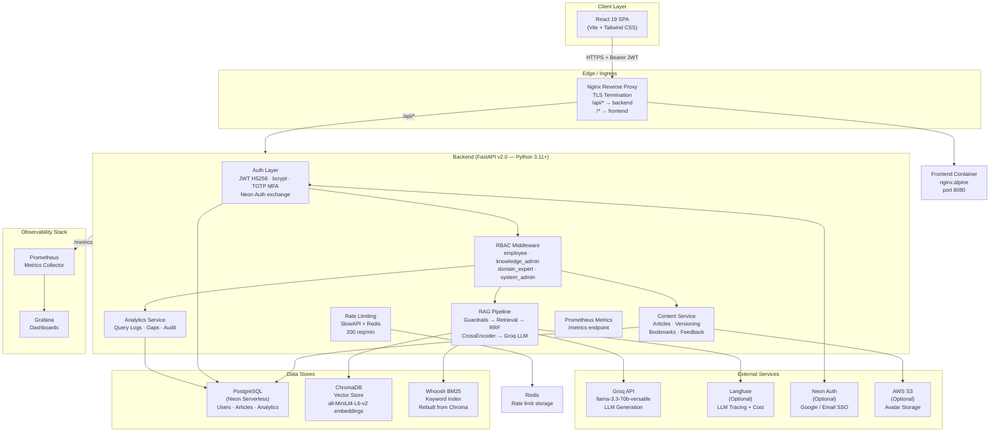
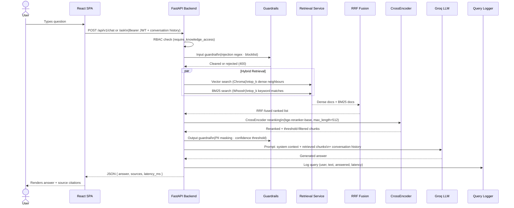
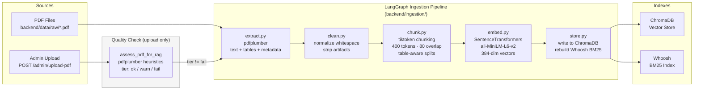
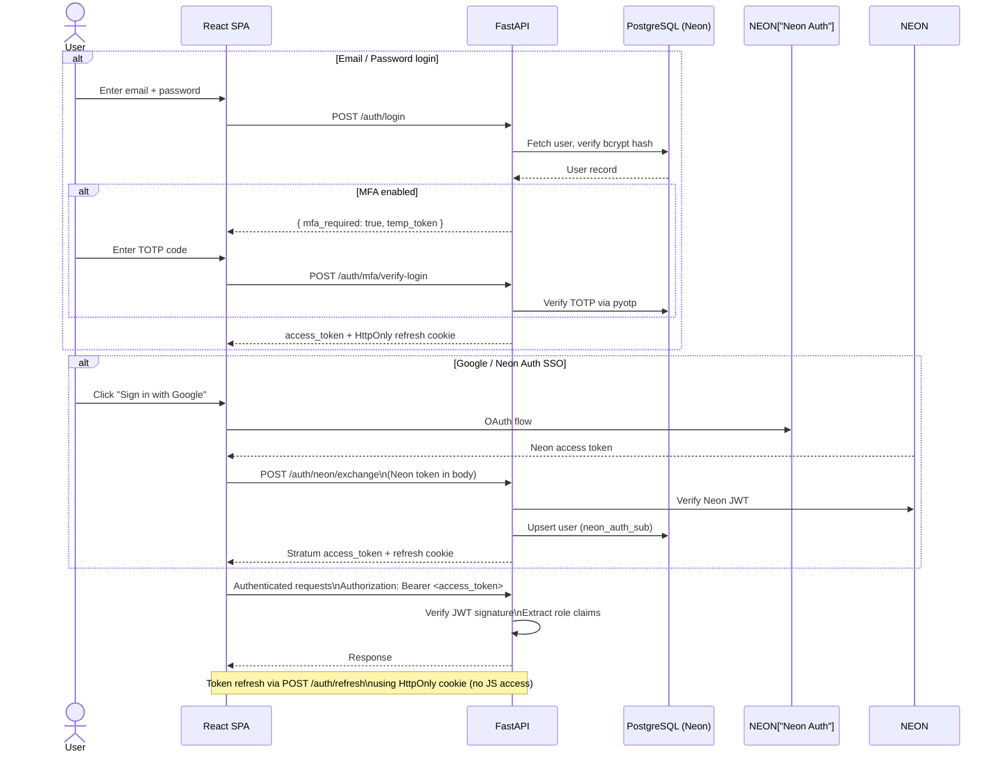
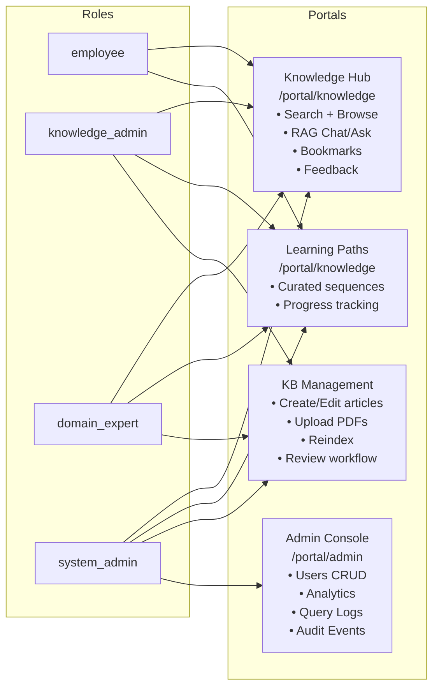
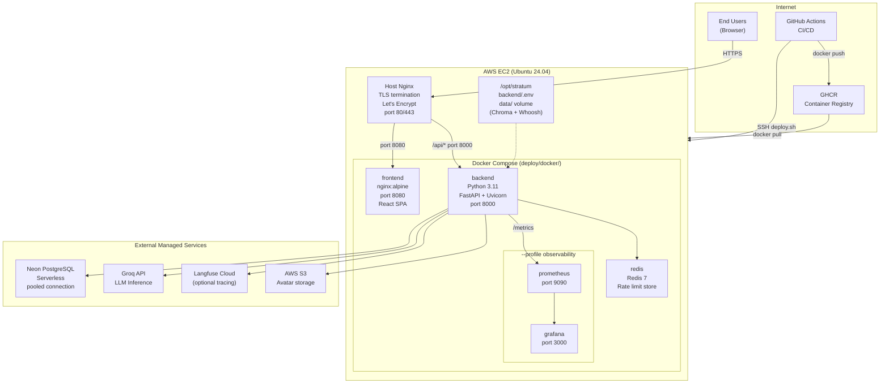
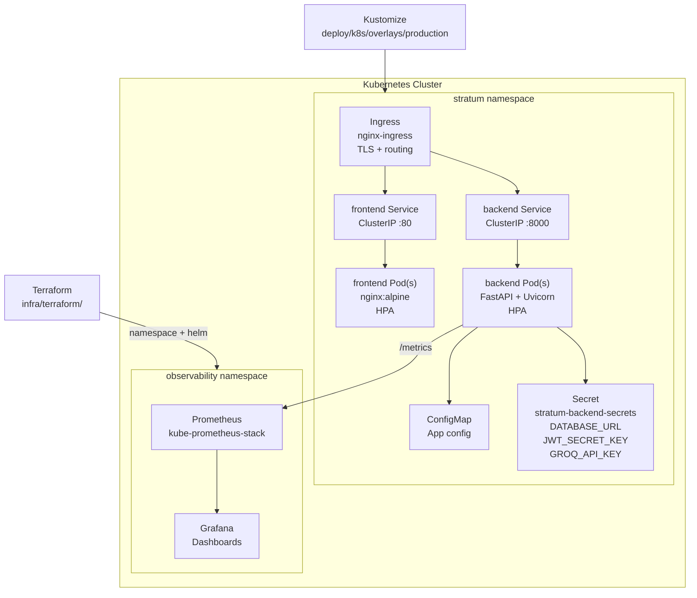

# Stratum — System Design

Stratum is an internal **knowledge management + hybrid RAG** platform for banking software teams. Employees search curated articles and PDFs, query an LLM with retrieval-augmented context, and authenticate via email/password with optional TOTP MFA — all backed by role-aware access controls and a full audit trail.

---

## 1. High-Level Architecture

---

## 2. Request Path — RAG Chat / Ask

---

## 3. Ingestion Pipeline

---

## 4. Authentication and Session Flow

---

## 5. Article Lifecycle

```mermaid
stateDiagram-v2
  [*] --> Draft : Author creates article
  Draft --> InReview : submit-review (knowledge_admin)
  InReview --> Draft : Request changes
  InReview --> Published : approve (knowledge_admin / domain_expert)
  Published --> Archived : archive (knowledge_admin / system_admin)
  Archived --> Published : unarchive
  Published --> InReview : Re-edit (creates new version)

  Draft : Draft\nOnly visible to author + admins
  InReview : In Review\nPending approval
  Published : Published\nVisible to all employees
  Archived : Archived\nHidden from search; version retained
```

---

## 6. RBAC and Portal Access Matrix

---

## 7. Deployment Topology (Production — Docker Compose on EC2)

---

## 8. Kubernetes Deployment Topology

---

## 9. Security Boundaries

| Boundary | Mechanism |
|----------|-----------|
| Transport | HTTPS everywhere; HSTS in production |
| Identity | JWT HS256 (access 15min) + HttpOnly refresh cookie (7 days) |
| Authorization | RBAC middleware on every API dependency |
| Input safety | Injection regex + blocklist guardrail before RAG |
| Output safety | PII masking (phone/email/card) + confidence threshold |
| Request size | `MAX_REQUEST_SIZE_MB` enforced in middleware |
| Rate limiting | SlowAPI 200 req/min; Redis-backed in production |
| Secrets | Never in Git; K8s Secrets + env files on host |
| API docs | Disabled in `ENVIRONMENT=production` by default |
| Security headers | CSP, X-Frame-Options, X-Content-Type-Options, Referrer-Policy, Permissions-Policy |
| Container scanning | Trivy CRITICAL-level scan in CI on every main push |
| Secret scanning | gitleaks in CI on every push |

---

## 10. Scaling Notes

- **Backend**: horizontal scale behind Ingress; shared Postgres and Groq API are already multi-tenant-safe. ChromaDB and Whoosh are **local-disk stores** — for multi-replica backends, migrate to a managed vector DB (Pinecone, Weaviate, pgvector) or use a shared PVC (read-only replicas OK for retrieval).
- **Embeddings**: the SentenceTransformer and CrossEncoder are loaded **once per process** as singletons (`app/services/rag_providers.py`). Each backend replica carries its own model copy. If memory is a constraint, extract to a dedicated inference service.
- **Ingestion**: run as a CronJob or manual admin trigger (`POST /admin/reindex`), not as a hot path. Consider DVC or LakeFS for corpus versioning under compliance requirements.
- **Rate limiting**: in-process `memory://` is safe for single-replica dev; **always use Redis in production** (required and enforced by startup validation when `ENVIRONMENT=production`).
