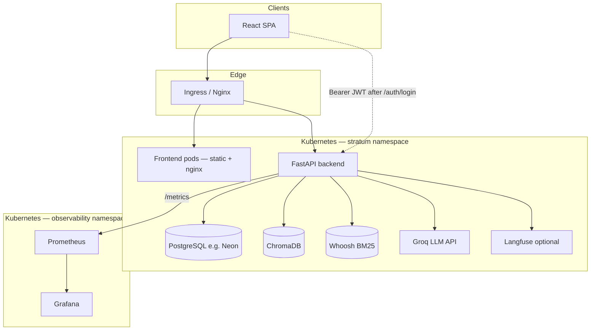
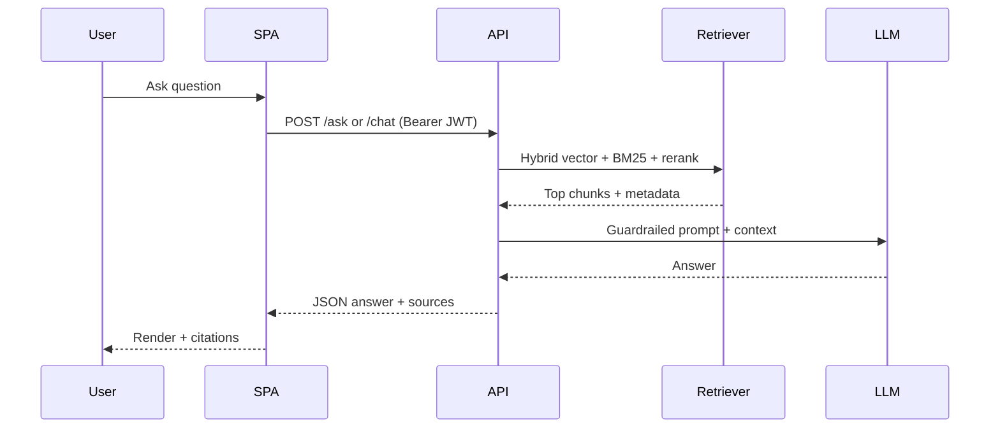
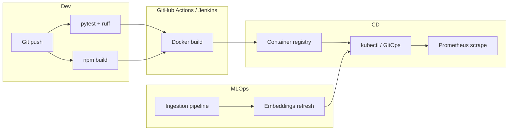

# Stratum — system design

Stratum is an internal **knowledge management + RAG** platform: employees search curated articles and PDFs, query an LLM with retrieval, and authenticate via email/password and optional MFA (Stratum-issued JWTs).

## High-level architecture

## Request path (RAG chat)

## DevOps / MLOps flow

## Security boundaries

- **RBAC** enforced in API dependencies; portal routes gated by role.
- **Primary database** is **PostgreSQL** (e.g. Neon) only (no SQLite in production paths).
- **Secrets** never in Git: use K8s Secrets + External Secrets / vault (see `config/SECRETS.md`).
- **CSP** on SPA; API returns security headers (see `app/main.py`).
- **OpenAPI / Swagger** are served in non-production environments for developer discovery (`/docs`, `/redoc`).

## Scaling notes

- **API**: horizontal scale behind Ingress; shared DB and vector store (move Chroma to managed vector DB for multi-replica consistency).
- **Embeddings**: batch ingestion jobs (CronJob) after PDF upload; consider **DVC** + object storage for training datasets if you add custom rankers (see `mlops/README.md`).
