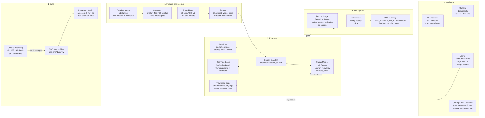

# MLOps — Lifecycle, Tooling, and CI Integration

*Documentation index: [docs/README.md](../docs/README.md)*

Stratum's ML surface today is **retrieval + LLM inference** rather than a large custom training loop. This means the MLOps lifecycle focuses on **data versioning, embedding pipeline management, evaluation, and deployment alignment** — not model training runs.

---

## MLOps Lifecycle Overview



---

## Stage-by-Stage Reference

### Stage 1: Data

| Concern | Current tooling | Recommended extension |
|---------|----------------|----------------------|
| Source storage | `backend/data/raw/*.pdf` on disk | Git LFS or S3 bucket with versioned objects |
| Corpus versioning | Not yet formalized | **DVC** (Data Version Control) or **LakeFS** for regulatory reproducibility |
| Quality gate | `assess_pdf_for_rag` on upload (pdfplumber heuristics) | Extend to CI nightly batch over `data/raw/*.pdf` |
| Deduplication | File hash check in LangGraph ingestion pipeline | Add near-duplicate detection (datasketch MinHash) across chunk content |

**Treating PDFs as versioned artifacts is critical for regulated environments.** If a regulator asks "which version of the KYC policy was in use on date X?", you need a corpus snapshot.

### Stage 2: Feature Engineering (Ingestion Pipeline)

The ingestion pipeline lives at `backend/ingestion/` and is implemented as a **LangGraph state machine**:

```
ingestion/
├── main.py        — entry point; runs full pipeline or admin-triggered reindex
├── config.py      — paths, model names, chunk settings
└── pipeline/
    ├── pipeline.py — LangGraph graph definition; state transitions
    ├── extract.py  — pdfplumber: text extraction + table detection
    ├── clean.py    — normalize whitespace, strip footers/headers
    ├── chunk.py    — tiktoken tokenizer; 400-token windows; 80-token overlap
    ├── embed.py    — SentenceTransformers all-MiniLM-L6-v2; batch encode
    └── store.py    — write to ChromaDB; rebuild Whoosh BM25 from Chroma docs
```

**Pinned config values (from `config.py`):**

| Parameter | Value | Notes |
|-----------|-------|-------|
| Embedding model | `all-MiniLM-L6-v2` | 384-dim, CPU-friendly |
| Chunk size | 400 tokens | tiktoken `cl100k_base` |
| Chunk overlap | 80 tokens | ~20% overlap for context continuity |
| Batch size | 64 (configurable) | Balance memory vs. throughput |
| Dedup method | SHA-256 file hash | Skips re-embedding unchanged files |

**Trigger methods:**
- Manual: `cd backend && python -m ingestion.main`
- Admin UI: `POST /api/v1/admin/reindex` (requires `ENABLE_ADMIN_REINDEX=true`)

### Stage 3: Evaluation

#### Offline evaluation (Ragas)

```bash
cd backend
python tools/evaluate_rag.py
# Reads: data/eval_qa.json (golden Q&A pairs)
# Outputs: data/eval_metrics_results.json
```

Ragas metrics computed:

| Metric | What it measures | Target |
|--------|-----------------|--------|
| `faithfulness` | Does the answer only use information from retrieved context? | > 0.85 |
| `answer_relevancy` | Is the answer relevant to the question? | > 0.80 |
| `context_recall` | Did retrieval find the relevant chunks? | > 0.75 |
| `context_precision` | Are retrieved chunks actually useful? | > 0.70 |

#### Production evaluation (Langfuse)

Every `/chat`, `/ask`, and `/search` call creates a Langfuse trace. Monitor in Langfuse dashboard:
- P50/P95/P99 end-to-end latency
- Token usage and cost per query
- Model responses for spot-checking

#### User-signal evaluation

- `/api/v1/feedback` — thumbs up/down + optional free-text per answer
- `GET /api/v1/admin/feedback` — admin view of all ratings
- `GET /api/v1/admin/knowledge-gaps` — unanswered query aggregation

Track: **feedback positive rate** (target > 70%) and **gap query growth rate** (should decrease over time as content improves).

### Stage 4: Deployment

Stratum uses the **same Docker image for the ML pipeline and the API** — no separate model server. Models are loaded as singletons on startup.

**Singleton loading (`app/services/rag_providers.py`):**

```python
# Called once per process; cached in module-level state
get_embedding_model()   # SentenceTransformer
get_reranker_model()    # CrossEncoder
get_chroma_client()     # ChromaDB PersistentClient
get_whoosh_searcher()   # Whoosh IndexSearcher
```

**Startup warmup:**

Set `RAG_WARMUP_ON_STARTUP=true` (recommended in production) to pre-load all singletons in a background thread immediately after startup. This eliminates first-query cold start latency (which can be 10–30s for model loading).

**Model update process** (when changing embedding model or reranker):

```
1. Update model name in backend/.env (EMBEDDING_MODEL / RERANKER_MODEL)
2. Run full reindex: python -m ingestion.main (rebuilds ChromaDB + Whoosh with new embeddings)
3. Build new Docker image
4. Deploy via standard CD pipeline (tag → GitHub Actions → deploy.sh)

IMPORTANT: embedding model and vector store must always be in sync.
Changing the embedding model without reindexing causes silent relevance regression.
```

### Stage 5: Monitoring

#### Metrics (Prometheus + Grafana)

Enable with `METRICS_ENABLED=true`. Scrape at `GET /metrics`.

Recommended Grafana dashboards:
- **API Health**: HTTP request rate, error rate (5xx), P95 latency
- **RAG Performance**: `/ask` + `/chat` endpoint latency distribution
- **Ingestion**: (manual instrumentation) chunk count, embedding time, index size

#### Alerting thresholds (recommended)

| Alert | Condition | Action |
|-------|-----------|--------|
| High 5xx rate | > 5% over 5 min | PagerDuty / Slack alert → check logs |
| RAG latency spike | P95 > 10s | Check Groq API status + reranker load |
| Prometheus scrape failure | Scrape target down | Check backend container health |
| Faithfulness drop (nightly) | Mean < 0.80 | Review recent PDF uploads + prompt |
| Feedback score decline | 7-day avg < 65% positive | Content review + potential RAG tuning |
| Knowledge gap growth | > 20 new gaps/week | Content manager action required |

---

## CI Integration for MLOps

### Existing CI hooks (`.github/workflows/ci.yml`)

- Blocks release if pytest fails
- Blocks release if Trivy CRITICAL CVE found in Docker image
- gitleaks blocks commits with secrets

### Recommended MLOps CI extensions

```yaml
# Add to .github/workflows/ci.yml — nightly eval job
nightly-rag-eval:
  runs-on: ubuntu-latest
  if: github.event_name == 'schedule'
  schedule:
    - cron: '0 2 * * *'   # 2 AM UTC nightly
  steps:
    - name: Run Ragas eval
      run: |
        cd backend
        pip install -r requirements-ci.txt
        python tools/evaluate_rag.py
    - name: Assert quality thresholds
      run: |
        python -c "
        import json
        results = json.load(open('data/eval_metrics_results.json'))
        assert results['faithfulness'] > 0.80, f'Faithfulness regression: {results[\"faithfulness\"]}'
        assert results['answer_relevancy'] > 0.75, f'Relevancy regression: {results[\"answer_relevancy\"]}'
        "
```

```yaml
# Add PDF quality gate for new PDFs in data/raw/
pdf-quality-gate:
  on:
    push:
      paths:
        - 'backend/data/raw/**'
  steps:
    - name: Assert PDF quality
      run: |
        cd backend
        python -c "
        from app.services.document_quality import assess_pdf_for_rag
        import glob, sys
        failures = []
        for pdf in glob.glob('data/raw/*.pdf'):
            report = assess_pdf_for_rag(pdf)
            if report.tier == 'fail':
                failures.append(f'{pdf}: {report.messages}')
        if failures:
            print('PDF quality failures:', failures)
            sys.exit(1)
        "
```

---

## Recommended Extensions

| Extension | Use case | Priority |
|-----------|----------|----------|
| **DVC** | Dataset versioning — track which corpus produced which eval results | High for compliance |
| **MLflow** (optional) | If you add custom fine-tuned rerankers — track model experiments | Medium |
| **LakeFS** | Immutable corpus snapshots with branch-merge semantics | Medium for regulated teams |
| **OpenTelemetry** | Distributed tracing across API + ingestion pipeline | Medium |
| **Ragas nightly CI** | Automated faithfulness regression detection | High |
| **Query preprocessing** | Spellcheck + banking acronym expansion before embed | Medium |
| **Streaming responses** | Stream Groq output tokens to SPA for perceived latency | Low |
| **MMR (Max Marginal Relevance)** | Source diversity — prevent same PDF dominating top-K | Medium |
| **HyDE (Hypothetical Doc Embedding)** | Query expansion for vague questions | Low |
| **RLHF from feedback** | Use thumbs-up/down to fine-tune a reranker | Future |

---

## Related Paths

| Path | Purpose |
|------|---------|
| `backend/ingestion/` | LangGraph ingestion pipeline source |
| `backend/tools/evaluate_rag.py` | Offline Ragas evaluation script |
| `backend/data/eval_qa.json` | Golden Q&A pairs for evaluation |
| `backend/data/eval_metrics_results.json` | Latest eval run results |
| `backend/app/services/rag_providers.py` | Model singleton management |
| `backend/app/services/document_quality.py` | PDF quality assessment |
| `backend/app/services/retrieval_service.py` | Hybrid retrieval (Chroma + Whoosh) |
| `backend/app/services/reranker_service.py` | CrossEncoder reranking |
| `backend/app/services/llm_service.py` | Groq LLM generation |
| `backend/app/services/guardrail_service.py` | Input/output safety guardrails |
| `backend/app/services/fusion.py` | Reciprocal Rank Fusion |
| `docs/RAG_PIPELINE.md` | RAG pipeline audit, gaps, enhancement roadmap |
| `observability/docker/` | Prometheus + Grafana Docker config |
| `infra/terraform/values/kube-prometheus-stack.yaml` | K8s observability bootstrap values |
